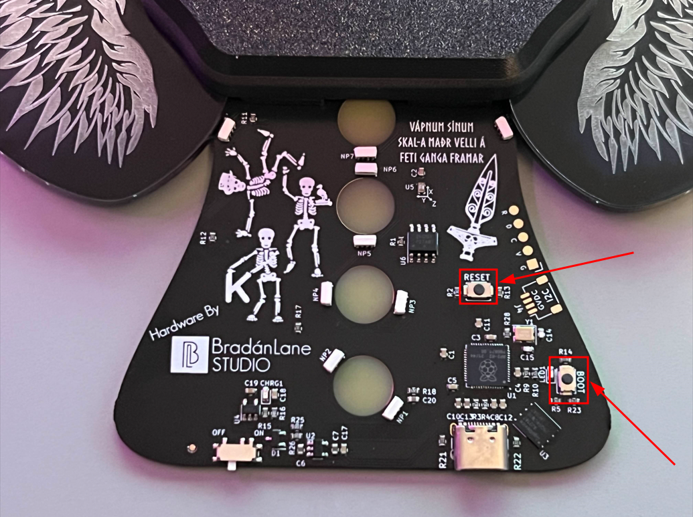

# Flashing Guide

This guide will walk you through the process of flashing your badge to the final firmware. Any sections not marked with a specific OS distribution (Windows, Mac, or Linux), are assumed to be platform agnostic. If at any point you fun into trouble flashing, please refer to the FAQ section below. If the FAQ section still does not solve your problem, please refer to the Contact an Adult section.

***

## Index

#### [1. Instructions](#Instructions)

#### [2. FAQ](#FAQ)

#### [3. Contact an Adult](#Contact-an-Adult)

#### [4. Image References](#Image-References)

***

## Instructions

#### <ins>Short Version</ins>

1. Download `firmware.uf2`
2. Power the badge on
3. Press and hold the "BOOT" button
4. Press and release the "RESET" button
5. Let go of the "BOOT" button
6. Plug badge into a computer 
7. Drag `firmware.uf2` into the `RPI-RP2` device that appears
8. Wait for the badge to flash and restart
9. Done

#### <ins>Long Version</ins>

1. Download the `firmware.uf2` file from this GitHub repository.
2. Power badge on by moving the switch located at the bottom of the badge into the "on" position.
	- The back of the badge will show which direction is "on" and which is "off". If your badge does not light up once turned on, plug the badge in via USB-C to ensure the badge is charged. Consult the FAQ if this does not fix the issue.
3. Press and hold the "BOOT" button, do not release this button until step 5. This button will be located on the back of the badge at the bottom right, and will subsequently be labeled as "BOOT".
4. Press and release the "RESET" button. This button will be located on the back of the badge towards the bottom right, and will be subsequently labeled as "RESET".
	- If you have trouble locating the "RESET" button, look up and to the left from the "BOOT" button.
	- This step should cause the screen and the yellow LED located next to the "BOOT" button to turn off, however the wing and Chakra LEDs will still be on.
5. Release the "BOOT" button, the screen and yellow LED should stay off during this step.
6. Using a USB-C cable, plug the badge into a computer of your choice.
	- The OS distribution of the computer does not matter, however if your OS does not auto-mount drives then you will need to take extra steps to properly flash the firmware.
7. If the previous steps were followed correctly, a new storage device named `RPI-RP2` will show up in your computer's file manager. Open the device in a file manager and move the `firmware.uf2` file downloaded in step 1 into the `RPI-RP2` device.
	- Windows: The folder should auto-open and be ready for a file to be dragged into it. If it does not, please see FAQ below.
	- Mac: You may have to use finder to search for the `RPI-RP2` device. If it cannot be found, please see FAQ below.
	- Linux: If your Linux distribution has auto-mount, then the device should show up in your file manager. If you do not have a Linux distribution that auto-mounts drives, you will need to manually mount the drive yourself. See FAQ for more details.
8. Be patient and wait for the file to copy. Once the file has fully copied, the `RPI-RP2` device will disconnect from your computer and automatically restart.
9. Once the device turns back on and displays the Menu screen, you have properly flashed your Chakra Badge with the final firmware!

***

## FAQ

#### My badge still doesn't power on even after turning the switch "on" and plugging in a USB-C cable

- Ensure that your USB-C cable is not broken, try testing on another device if possible.
- Ensure that the yellow LED labeled CHRG1 located on the back of the badge above the on/off switch lights up when a USB-C cable is plugged in.
	- If this LED does not light up, please refer to the Contact an Adult section below.
- Keep your badge plugged in to USB-C power for 15 minutes, then try powering it again (the battery could be discharged below the minimum required voltage to power the badge).

#### My device wont stay in "flashing mode" after holding BOOT and pressing RESET

- Ensure you are properly holding boot, waiting a second, then pressing RESET all the way down, and finally releasing boot.
	- If this does not work the first time, try it 2-3 times to ensure the problem does not lie with user error.
- If the problem is not user error, try the following set of actions:
	1. Make sure the badge is off, and hold down the BOOT button.
	2. While holding the BOOT button turn the badge on.
	3. The badge should now be in flashing mode, no LEDs will turn on.
		- Plug your Chakra Badge into a computer to verify that the RPI-RP2 device shows up

#### I cannot locate the RPI-RP2 device on my computer

- Ensure that your USB-C cable is a USB-C data cable, and can transfer data over the cable and is not a power-only cable.
	- Refer to the product details for the specific USB-C cable you purchased to determine this information. If you do not have this information and are still having issues, please refer to Contact an Adult below.
- Ensure that your computer auto-mounts external drives and does not require you to manually mount the RPI-RP2 device.
	- Most operating systems will auto-mount drives for you, however some Linux distributions will require you mount the drive manually.
	- If you are having issues on a Mac or Linux OS, it is recommended to use a Windows computer for flashing as it will be the most user-friendly process.

***

## Contact an Adult

If all else fails, contact an adult. For issues that you cannot resolve yourself, see below for BadgeDev contact details 

#### [Discord](https://discord.gg/snekb2xUbS)

- Get general help - [chakra-badge-public-chat](https://discord.com/channels/669744712709570571/1231651967219138582)
- Get specific help - Tag / Message @txnner or @kevinthomas

#### [GitHub Issue](https://github.com/DC540-Nova/DC32-Chakra-Badge/issues)

- Create a GitHub issue if you have specific questions regarding flashing or the badge as a whole.
	- Discord is recommended, but in the event you do not have Discord, this works too.

***

## Image References

### Badge LEDs

### Badge Buttons

### Badge ON/OFF Switch

### Badge Board

### Badge Back

### Badge Front

